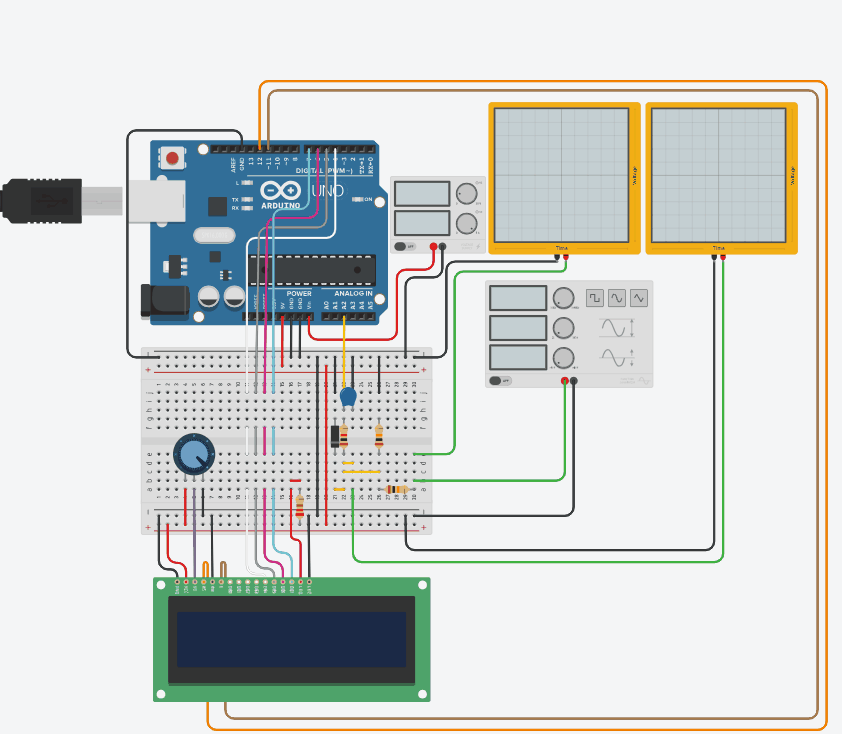

# Budget Oscilloscope Project

---

Welcome to the **Budget Oscilloscope** project!  
This project showcases a simple, low-cost oscilloscope built around an Arduino Uno, a 16x2 LCD display, and basic passive circuitry. It's designed as part of my Electronic Engineering Portfolio of Evidence.

---

## 📄 Project Overview

**Goal:**  
To create a basic oscilloscope capable of measuring and displaying low-frequency analog signals (~0–5V) using minimal components.

**Features:**
- 16x2 character LCD live-updating with ADC readings and voltage calculations.
- Voltage scaling via a resistor voltage divider to safely interface higher voltages with Arduino analog inputs.
- Visual demonstration of analog signal tracking (with a GIF demo!).
- Clean, commented Arduino code for easy understanding and extension.

---

> **Note:** At higher frequencies, Arduino’s analog sampling limitations become noticeable. The system works best for **very low frequency** signals (~0–10Hz).

---

## 🛠️ System Components

- Arduino Uno
- 16x2 LCD Display (parallel mode)
- Voltage Divider Circuit (R1 = R2 to halve the input signal)
- Potentiometer for LCD contrast adjustment
- Basic Breadboard & Jumper Wires
- Signal Generator (external, for testing)

---

## ⚡ Circuit Overview

The input analog signal is passed through a resistive voltage divider, ensuring safe voltage levels (within Arduino’s 0–5V ADC range). The LCD is wired in 4-bit mode for data efficiency, with the following pin connections:

| LCD Pin | Arduino Pin |
|:--------|:------------|
| RS      | D12         |
| E       | D11         |
| D4      | D4          |
| D5      | D5          |
| D6      | D6          |
| D7      | D7          |

**Analog Input:**  
Signal measured on Arduino Analog Pin **A2**.

---

## 🧹 How It Works

1. On startup, the LCD displays a welcome message ("Hello Oscilloscope!").
2. After a short delay (1000ms), the LCD switches to live measurements.
3. The analog input from A2 is read, converted to a voltage, and displayed:
   - **First line:** Raw ADC value (0–1023)
   - **Second line:** Calculated voltage (0.00–5.00V)

4. The display refreshes approximately every 100ms for near-real-time updates.

---

## 📊 Observations

- The voltage divider halves the amplitude of the input signal effectively.
- Minor waveform distortion is visible, especially near the negative peaks.  
  This is expected due to Arduino’s ADC being single-ended (0V to 5V only) and not handling negative voltages naturally.
- The system is excellent for educational purposes, low-frequency signal visualization, and basic embedded systems demonstrations.

---

## 📂 Repository Contents

| File | Description |
|:-----|:------------|
| `BudgetOscilloscope.ino` | Arduino source code |
| `circuit_diagram.png` | Circuit schematic |
| `demo.gif` | 15-second demonstration GIF |
| `README.md` | This documentation |

---

## 🚀 Future Improvements

- Add signal averaging or smoothing filters for cleaner measurements.
- Expand to multi-channel input selection using buttons.
- Upgrade to a graphical LCD (e.g., 128x64) for waveform plotting.
- Incorporate external op-amps to safely shift and amplify signals.

---

## 👤 Author

Created by [Yasteer Sewpersad](https://github.com/Yasteer)  
Electronic Engineering Portfolio of Evidence

---

## 📌 License

This project is licensed under the [MIT License](LICENSE).

